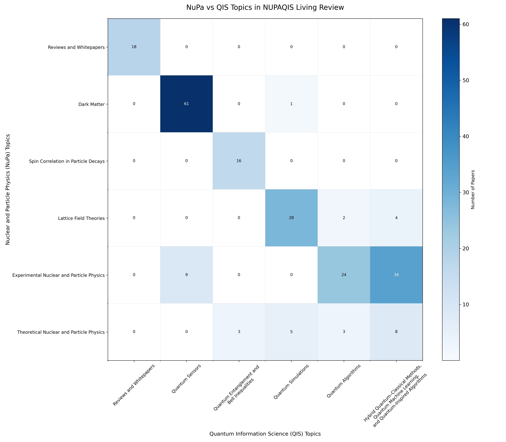
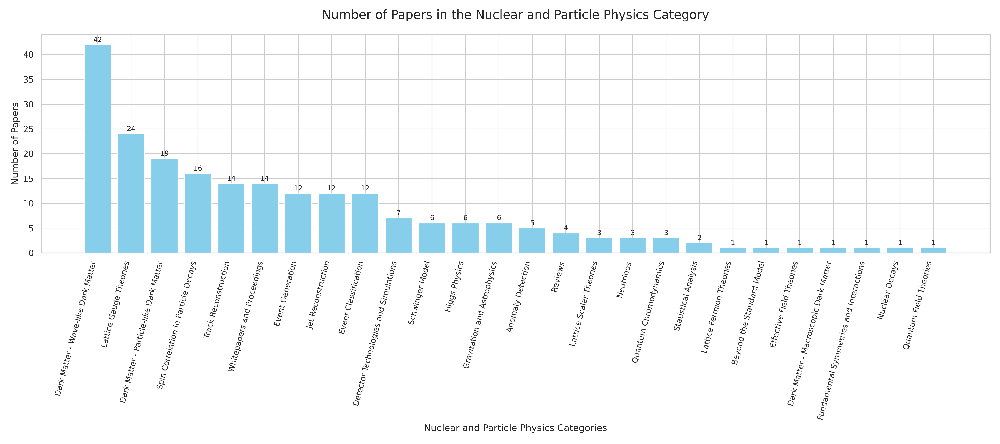
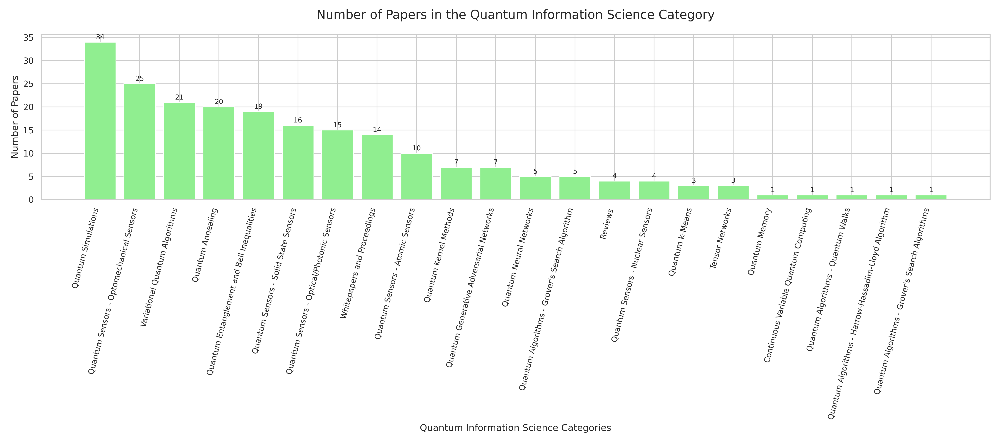

# A Living Review of Quantum Information Science in Nuclear and Particle Physics

 

Authors: Pamela Pajarillo, So Chigusa, Sokratis Trifinopoulos, Jesse Thaler 
 
*Inspired by <a href="https://iml-wg.github.io/HEPML-LivingReview/">"A Living Review of Machine Learning for High Energy Physics"</a>, the goal of this repository is to provide an extensive list of citations for those developing and applying quantum information approaches to experimental, phenomenological, or theoretical analyses.  Applications of quantum information science to high energy physics is a relatively new field of research.  This repository will be updated as often as possible with the relevant literature.  Suggestions are most welcome.*

The goal of this repository is to collect references for quantum information science as applied to particle and nuclear physics. The papers are listed in chronological order. Reviews, whitepapers, and inproceedings are listed at the beginning of each section and can be found <a href="/BY_NUPA/README.md#textbfreviews-and-whitepapers"> here </a>. 

The repository is organized in two ways: 
*  NuPa topics are the main categories and QIS topics are the subcategories 
*  QIS topics are the main categories and NuPa topics are the subcategories

The NuPa and QIS topics and a plot of the papers by NuPaQIS are listed below. 

##  $\textbf{\color{#5BC0EB}{Nuclear and Particle Physics (NuPa) Topics}}$

 <b>Reviews, Whitepapers, and Proceedings: </b> <a href="/BY_NUPA/README.md#textbfreviews-and-whitepapers"> Link to Papers </a>  <code>Expand for Description</code> 

The references below contain (static) reviews and whitepapers listed in applications of quantum information science to particle physics. Note that the majority of the references are from the Snowmass Community Planning Exercises.

 <b>Anomaly Detection: </b> <a href="/BY_NUPA/README.md#textbfcolor9bc53danomaly-detection"> Link to Papers </a>  <code>Expand for Description</code> 

 <b>Beyond the Standard Model: </b> <a href="/BY_NUPA/README.md#textbfcolor9bc53dbeyond-the-standard-model"> Link to Papers </a>  <code>Expand for Description</code> 

 <b>Dark Matter - Particle-like Dark Matter: </b> <a href="/BY_NUPA/README.md#textbfcolor9bc53ddark-matter---particle-like-dark-matter"> Link to Papers </a>  <code>Expand for Description</code> 

A list of article-like dark matter candidates include: 
  - Weakly Interacting Massive Particles (WIMPs)
  - Light Dark Matter
  - Millicharged Particles
  - Dark Photons (massive)
  - Sterile Neutrinos

 <b>Dark Matter - Wave-like Dark Matter: </b> <a href="/BY_NUPA/README.md#textbfcolor9bc53ddark-matter---wave-like-dark-matter"> Link to Papers </a>  <code>Expand for Description</code> 

A list of article-like dark matter candidates include: 
  - Axions and Axion-like Particles (ALPs): An axion is a hypothetical particle theorized to solve the strong CP problem in quantum chromodynamics (QCD) and the cosmological matter-antimatter asymmetry.
  - Ultralight Dark Matter: 
  - Fuzzy Dark Matter:
  - Dark Photons (ultralight):
References:
  - [Axion Dark Matter: What is it and Why Now?](https://arxiv.org/abs/2105.01406)
  - [PDG Review on Axions and Axion-like Particles](https://pdg.lbl.gov/2024/reviews/rpp2024-rev-axions.pdf)

 <b>Dark Matter - Macroscopic Dark Matter: </b> <a href="/BY_NUPA/README.md#textbfcolor9bc53ddark-matter---macroscopic-dark-matter"> Link to Papers </a>  <code>Expand for Description</code> 

A list of article-like dark matter candidates include: 
  - Primordial Black Holes: 
  - Compact Composite Objects: 
  - Q-balls:

 <b>Detector Technologies and Simulations: </b> <a href="/BY_NUPA/README.md#textbfcolor9bc53ddetector-technologies-and-simulations"> Link to Papers </a>  <code>Expand for Description</code> 

 <b>Effective Field Theories: </b> <a href="/BY_NUPA/README.md#textbfcolor9bc53deffective-field-theories"> Link to Papers </a>  <code>Expand for Description</code> 

 <b>Event Classification: </b> <a href="/BY_NUPA/README.md#textbfcolor9bc53devent-classification"> Link to Papers </a>  <code>Expand for Description</code> 

Signal and background classification for particle physics events.

 <b>Event Generation: </b> <a href="/BY_NUPA/README.md#textbfcolor9bc53devent-generation"> Link to Papers </a>  <code>Expand for Description</code> 

 <b>Fundamental Symmetries and Interactions: </b> <a href="/BY_NUPA/README.md#textbfcolor9bc53dfundamental-symmetries-and-interactions"> Link to Papers </a>  <code>Expand for Description</code> 

 <b>Gravitation and Astrophysics: </b> <a href="/BY_NUPA/README.md#textbfcolor9bc53dgravitation-and-astrophysics"> Link to Papers </a>  <code>Expand for Description</code> 

 <b>Higgs Physics: </b> <a href="/BY_NUPA/README.md#textbfcolor9bc53dhiggs-physics"> Link to Papers </a>  <code>Expand for Description</code> 

 <b>Jet Reconstruction: </b> <a href="/BY_NUPA/README.md#textbfcolor9bc53djet-reconstruction"> Link to Papers </a>  <code>Expand for Description</code> 

1) Jet Clustering, 2) Jet Tagging, and 3) Jet Identification 

 <b>Lattice Scalar Theories: </b> <a href="/BY_NUPA/README.md#textbfcolor9bc53dlattice-scalar-theories"> Link to Papers </a>  <code>Expand for Description</code> 

 <b>Lattice Fermion Theories: </b> <a href="/BY_NUPA/README.md#textbfcolor9bc53dlattice-fermion-theories"> Link to Papers </a>  <code>Expand for Description</code> 

 <b>Lattice Gauge Theories: </b> <a href="/BY_NUPA/README.md#textbfcolor9bc53dlattice-gauge-theories"> Link to Papers </a>  <code>Expand for Description</code> 

 <b>Neutrinos: </b> <a href="/BY_NUPA/README.md#textbfcolor9bc53dneutrinos"> Link to Papers </a>  <code>Expand for Description</code> 

 <b>Nuclear Decays: </b> <a href="/BY_NUPA/README.md#textbfcolor9bc53dnuclear-decays"> Link to Papers </a>  <code>Expand for Description</code> 

 <b>Quantum Chromodynamics: </b> <a href="/BY_NUPA/README.md#textbfcolor9bc53dquantum-chromodynamics"> Link to Papers </a>  <code>Expand for Description</code> 

 <b>Quantum Gravity: </b> <a href="/BY_NUPA/README.md#textbfcolor9bc53dquantum-gravity"> Link to Papers </a>  <code>Expand for Description</code> 

 <b>Quantum Field Theories: </b> <a href="/BY_NUPA/README.md#textbfcolor9bc53dquantum-field-theories"> Link to Papers </a>  <code>Expand for Description</code> 

 <b>Spin Correlation in Particle Decays: </b> <a href="/BY_NUPA/README.md#textbfcolor9bc53dspin-correlation-in-particle-decays"> Link to Papers </a>  <code>Expand for Description</code> 

 <b>Statistical Analysis: </b> <a href="/BY_NUPA/README.md#textbfcolor9bc53dstatistical-analysis"> Link to Papers </a>  <code>Expand for Description</code> 

 <b>Schwinger Model: </b> <a href="/BY_NUPA/README.md#textbfcolor9bc53dschwinger-model"> Link to Papers </a>  <code>Expand for Description</code> 

 <b>Track Reconstruction: </b> <a href="/BY_NUPA/README.md#textbfcolor9bc53dtrack-reconstruction"> Link to Papers </a>  <code>Expand for Description</code> 

##  $\textbf{\color{#9BC53D}{Quantum Information Science (QIS) Topics}}$

 <b>Reviews, Whitepapers, and Proceedings: </b> <a href="/BY_QIS/README.md#textbfreviews-and-whitepapers"> Link to Papers </a>  <code>Expand for Description</code> 

The references below contain (static) reviews and whitepapers listed in applications of quantum information science to particle physics. Note that the majority of the references are from the Snowmass Community Planning Exercises.

 <b>Continuous Variable Quantum Computing: </b> <a href="/BY_QIS/README.md#textbfcolor5bc0ebcontinuous-variable-quantum-computing"> Link to Papers </a>  <code>Expand for Description</code> 

 <b>Quantum Algorithms - Grover's Search Algorithm: </b> <a href="/BY_QIS/README.md#textbfcolor5bc0ebquantum-algorithms---grover's-search-algorithm"> Link to Papers </a>  <code>Expand for Description</code> 

The quantum search algorithm, also known as Grover's algorithm, performs a generic search for a solution to a search problem, using a technique known as amplitude amplification, which increases the amplitude of the desired states. Assuming that the solutions of the search problem can be expressed as binary strings of length $n$, such that $N= 2^n$, where $N$ is the dimension of the search space, then any search problem can be represented as a function $f(x)$ where $$ f(x) = \begin{cases}1 & \text{if $x$ is a solution} \\ 0 & \text{otherwise} \end{cases}$$ Grover's algorithm aims to find an input $x \in \{0,1\}^n$ such that $f(x) = 1$. Suppose the function $f$ is implemented by an oracle, a black box that can recognize solutions to the search problem. Classically, it would take $\mathcal{O}(N)$ queries to the oracle to find the solution, however, using Grover's algorithm would allow this search to be sped up substantially, requiring only $\mathcal{O}(\sqrt{N})$ queries. The quantum oracle can be represented by a unitary operator $U_f$, defined by $U_f : \ket{x} \ket{q} \rightarrow \ket{x} \ket{q \oplus f(x)}$, where $\ket{x}$ is the index register, $\ket{q}$ is the oracle register consisting of a single qubit which is flipped if $f(x) = 1$ and unchanged otherwise, and $\oplus$ is addition modulo 2. Let $\ket{q} = \ket{0}$, then given a query value $x$, prepare the state $\ket{x} \ket{0}$, apply oracle $U_f$, and measure the oracle qubit. If the oracle qubit has flipped to $ \ket{1}$, then $x$ is a solution to the search problem. If the oracle qubit is $\ket{q} = \frac{1}{\sqrt{2}}(\ket{0} - \ket{1})$, then the action of the oracle $U_f$ is $$U_f \; : \; \ket{x} \frac{1}{\sqrt{2}}(\ket{0} - \ket{1}) \longmapsto (-1)^{f(x)}\ket{x} \frac{1}{\sqrt{2}}(\ket{0} - \ket{1}) $$ Note that the state of the oracle qubit $\ket{q} $ has not changed, in other words $\frac{1}{\sqrt{2}}(\ket{0} - \ket{1})$ is an eigenstate, therefore, the oracle can be ignored, and the action of $U_f$ is given by $$U_f \; : \; \ket{x} \longmapsto (-1)^{f(x)} \ket{x}$$ Therefore, the oracle marks the solution to the search problem by a phase shift. Define an $n$-qubit phase shift operator $U_s$ with the following action, $ U_s \; : \; \ket{x} \mapsto (-1)^{\delta_{x_0}} \ket{x}$. $U_s$ applies a phase shift to all $n$-qubit states orthogonal to $\ket{00\ldots0}$. \\\\ The Grover's algorithm is as follows: \begin{enumerate} \item Start with the $n$-qubit state initialized in the state $\ket{00\ldots0}$ \item Apply the $n$-qubit Hadamard gate $H$ to prepare the state $\frac{1}{\sqrt{N}} \ket{\psi} = \sum_{x=0}^{N-1}\ket{x}$, where $N = 2^n$ \item Apply the following subroutine Grover iterate $G = HU_sHU_f$ a total of $\lfloor \frac{\pi}{4} \frac{1}{\sqrt{N}}\rfloor$ times \begin{enumerate} \item Apply the oracle $U_f$ \item Apply the $n$-qubit Hadamard gate $H$ \item Apply the phase shift operator $U_s$ \item Apply the $n$-qubit Hadamard gate \end{enumerate} \item Measure the resulting state \end{enumerate} Grover's search algorithm can be generalized to a process known as amplitude amplification.

 <b>Quantum Algorithms - Harrow-Hassadim-Lloyd Algorithm: </b> <a href="/BY_QIS/README.md#textbfcolor5bc0ebquantum-algorithms---harrow-hassadim-lloyd-algorithm"> Link to Papers </a>  <code>Expand for Description</code> 

 <b>Quantum Algorithms - Quantum Walks: </b> <a href="/BY_QIS/README.md#textbfcolor5bc0ebquantum-algorithms---quantum-walks"> Link to Papers </a>  <code>Expand for Description</code> 

 <b>Quantum Annealing: </b> <a href="/BY_QIS/README.md#textbfcolor5bc0ebquantum-annealing"> Link to Papers </a>  <code>Expand for Description</code> 

Quantum annealing is a quantum computing method used to solve optimization problems. It is currently the only quantum computing paradigm that enables architectures with large number of qubits, such as D-Wave Systems' Pegasus quantum processor chip with 5000 qubits. The classical counterpart, simulated annealing, mimics the process of heating up a material above its recrystallization temperature then cooled down slowly in order to change the material to a desirable structure. Simulated annealing is capable of finding global extrema as it is able to escape local extrema. The simulated annealing algorithm is as follows: (1) Start with an initial solution $s = s_0$ and an initial temperature $t = t_0$, Let $E(s)$ be the loss function of $s$; (2) Define a temperature reduction scheme. Some examples of temperature reduction schemes are: $t = t - \alpha$, $t = t\alpha$, and $t = \frac{t}{1+\alpha t}$; (3) Starting at $t = t_0$, consider some neighborhood of solution $N(s)$, and pick one of the solutions $s'$; (4) Calculate the difference of the loss function $\delta E$ between the solutions $s$ and $s'$. If $\delta E \geq 0$, accept the new solution. If $\delta < 0$, generate a uniform random number $r$ between 0 and 1. Accept the solution if $r < e^{\frac{\delta E}{t}}$. Note that for large $t$, the probability of selecting $s'$ is high; (5) Repeat steps (3) and (4) for $n$ iterations, updating $t$ given by the temperature reduction rule. \\\\ Quantum annealers solve very specific optimization problems called Quadratic Unconstrained Binary Optimization (QUBO) problems. The QUBO problem consists of finding a binary string that is minimal with respect to a quadratic polynomial over binary variables. The main challenge is to rephrase the loss function to a QUBO problem, which is equivalent to finding the ground state of a corresponding Ising model, whose Hamiltonian is given by $$H(\sigma) = \sum_{i,j=1}^{n}J_{ij} s_i s_j + \sum_{i=1}^{n} h_i s_i$$ where $s_i \in \{-1, +1\}$ are the spin values, and $h_i$ and $J_{ij}$ are adjustable constants that represents biases and coupling strengths, respectively. The Hamiltonian of the quantum version of the Ising model, the transverse field Ising model, is given by $$ H_f = \sum_{i,j = 1}^{n}J_{ij}\sigma_{i}^{z}\sigma_{j}^{z} + \sum_{i}^{n}h_i\sigma_{i}^{z} $$ where $\sigma_{i}^{z}$ is the Pauli-$Z$ acting on qubit $i$. In quantum annealing, one initializes the system in the ground state of the initial Hamiltonian $H_i$, given by $$ H_i = \sum_{i=1}^{n}\sigma_{i}^{x} $$ corresponding to the state $(\ket{0} + \ket{1})^{\otimes n}$. The quantum adiabatic theorem states that if the transition between two Hamiltonians is gradual, the system will stay in the ground state. After initializing the system, it slowly evolves by changing the Hamiltonian given by $$ H(t) = \left(1 - \frac{t}{T}\right)H_i + \frac{t}{T} H_f $$ where $T$ is the total time in the annealing process. Measuring the final state after the anneal will give the solution to the QUBO problem, since the final system is in an eigenstate of $H_f$.

 <b>Quantum Entanglement and Bell Inequalities: </b> <a href="/BY_QIS/README.md#textbfcolor5bc0ebquantum-entanglement-and-bell-inequalities"> Link to Papers </a>  <code>Expand for Description</code> 

 <b>Quantum Generative Adversarial Networks: </b> <a href="/BY_QIS/README.md#textbfcolor5bc0ebquantum-generative-adversarial-networks"> Link to Papers </a>  <code>Expand for Description</code> 

 <b>Quantum Kernel Methods: </b> <a href="/BY_QIS/README.md#textbfcolor5bc0ebquantum-kernel-methods"> Link to Papers </a>  <code>Expand for Description</code> 

 <b>Quantum k-Means: </b> <a href="/BY_QIS/README.md#textbfcolor5bc0ebquantum-k-means"> Link to Papers </a>  <code>Expand for Description</code> 

 <b>Quantum Memory: </b> <a href="/BY_QIS/README.md#textbfcolor5bc0ebquantum-memory"> Link to Papers </a>  <code>Expand for Description</code> 

 <b>Quantum Neural Networks: </b> <a href="/BY_QIS/README.md#textbfcolor5bc0ebquantum-neural-networks"> Link to Papers </a>  <code>Expand for Description</code> 

 <b>Quantum Sensors - Atomic Sensors: </b> <a href="/BY_QIS/README.md#textbfcolor5bc0ebquantum-sensors---atomic-sensors"> Link to Papers </a>  <code>Expand for Description</code> 

A list of atomic sensors include:
  - Atomic clocks
  - Atom interferometers
  - Atomic ensembles
  - Rydberg atoms
  - Trapped ions
  - Penning traps

 <b>Quantum Sensors - Molecular Sensors: </b> <a href="/BY_QIS/README.md#textbfcolor5bc0ebquantum-sensors---molecular-sensors"> Link to Papers </a>  <code>Expand for Description</code> 

A list of molecular sensors include:
  - Molecular clocks
  - Trapped molecules 

 <b>Quantum Sensors - Nuclear Sensors: </b> <a href="/BY_QIS/README.md#textbfcolor5bc0ebquantum-sensors---nuclear-sensors"> Link to Papers </a>  <code>Expand for Description</code> 

A list of nuclear sensors include:
  - Nuclear clocks
  - Nuclear spin ensembles

 <b>Quantum Sensors - Optical/Photonic Sensors: </b> <a href="/BY_QIS/README.md#textbfcolor5bc0ebquantum-sensors---optical/photonic-sensors"> Link to Papers </a>  <code>Expand for Description</code> 

A list of optical/photonic sensors include:
  - Superconducting Qubits measuring electomagnetic fields
  - Optical cavities
  - Superconducting radio frequency cavities
  - Squeezed-light interferometers

 <b>Quantum Sensors - Optomechanical Sensors: </b> <a href="/BY_QIS/README.md#textbfcolor5bc0ebquantum-sensors---optomechanical-sensors"> Link to Papers </a>  <code>Expand for Description</code> 

A list of optical/photonic sensors include:
  - Mechanical sensors
  - Levitated sensors

 <b>Quantum Sensors - Solid State Sensors: </b> <a href="/BY_QIS/README.md#textbfcolor5bc0ebquantum-sensors---solid-state-sensors"> Link to Papers </a>  <code>Expand for Description</code> 

Solid state sensors measures quantum excitations in the solid material itself A list of solid state sensors include: - Nitrogen-vacancy centers - Quantum dots - Superconducting Quantum Interference Devices (SQUIDs) - Superconducting qubits measuring quantum excitations

 <b>Quantum Simulations: </b> <a href="/BY_QIS/README.md#textbfcolor5bc0ebquantum-simulations"> Link to Papers </a>  <code>Expand for Description</code> 

 <b>Tensor Networks: </b> <a href="/BY_QIS/README.md#textbfcolor5bc0ebtensor-networks"> Link to Papers </a>  <code>Expand for Description</code> 

 <b>Variational Quantum Algorithms: </b> <a href="/BY_QIS/README.md#textbfcolor5bc0ebvariational-quantum-algorithms"> Link to Papers </a>  <code>Expand for Description</code> 

Variational Quantum Algorithms (VQAs) are hybrid quantum-classical algorithms that find approximate solutions to optimization problems. VQAs starts with a parameterized quantum circuit (PQC) where the parameters are optimized by a classical optimizer to minimize (or maximize) a cost function. 

## Number of Papers in NuPaQIS

