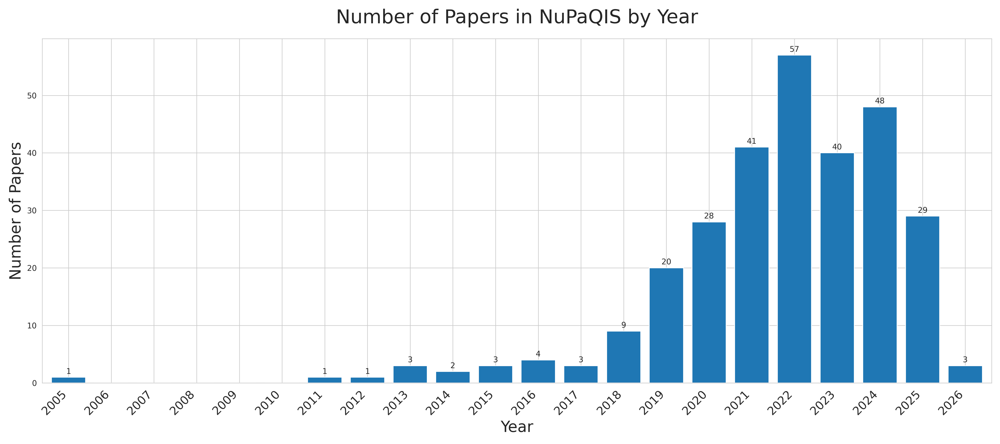

# A Living Review of Quantum Information Science in Nuclear and Particle Physics

 

Authors: Pamela Pajarillo, So Chigusa, Sokratis Trifinopoulos, Jesse Thaler 
 
Number of Papers: 293 
 
*Inspired by <a href="https://iml-wg.github.io/HEPML-LivingReview/">"A Living Review of Machine Learning for High Energy Physics"</a>, the goal of this repository is to provide an extensive list of citations for those developing and applying quantum information approaches to experimental, phenomenological, or theoretical analyses.  Applications of quantum information science to high energy physics is a relatively new field of research.  This repository will be updated as often as possible with the relevant literature.  Suggestions are most welcome.*

The goal of this repository is to collect references for quantum information science as applied to particle and nuclear physics. The papers are listed in chronological order. Reviews, whitepapers, and inproceedings are listed at the beginning of each section and can be found <a href="/BY_NUPA/README.md#textbfreviews-and-whitepapers"> here </a>. 

The repository is organized in two ways: 
*  NuPa topics are the main categories and QIS topics are the subcategories 
*  QIS topics are the main categories and NuPa topics are the subcategories

The NuPa and QIS topics and a plot of the papers by NuPaQIS are listed below. 

##  $\textbf{\color{#5BC0EB}{Nuclear and Particle Physics (NuPa) Topics}}$

 <b>Reviews, Whitepapers, and Proceedings: </b> <a href="/BY_NUPA/README.md#textbfreviews-and-whitepapers"> Link to Papers </a>  <code>Expand for Description</code> 

The references below contain (static) reviews and whitepapers listed in applications of quantum information science to particle physics. Note that the majority of the references are from the Snowmass Community Planning Exercises.

 <b>Anomaly Detection: </b> <a href="/BY_NUPA/README.md#textbfcolor9bc53danomaly-detection"> Link to Papers </a>  <code>Expand for Description</code> 

Searching for Beyond the Standard Model (BSM) is one of the most important tasks at the Large Hadron Collider (LHC). Traditional searches at the LHC typically look for specific theoretical BSM signal(s). Hundreds of searches for new particles have been performed at the LHC, and so far, there has been no significant deviation observed from the SM. This motivates the need for more model-agnostic search strategies that can look for any data feature inconsistent with the Standard Model, regardless of the underlying BSM hypothesis. Anomaly detection is a strategy that aims to identify events that deviate from the expected background without relying on specific signal models. Anomaly detection can be performed using machine learning techniques, which can be broadly categorized into unsupervised, weakly supervised, and semi-supervised methods. Unsupervised methods do not have any label information and learn directly from the background-dominated data. Weakly supervised methods have noisy labels, meaning that the labels are 'possibly signa l-depleted' or 'possibly signal-enriched'. Semi-supervised methods have a small amount of labeled data, where signal simulations are used to build some signal sensitivity. Additionally, it has been proposed to use anomaly detection to look for BSM physics at the trigger level, which is the first stage of data processing at the LHC, and for detector monitoring to maintain high data quality. These methods will be crucial for the next generation of collider experiments, such as the High-Luminosity LHC (HL-LHC), which will produce an unprecedented amount of data.

References:
  - The LHC Olympics 2020: A Community Challenge for Anomaly Detection in High Energy Physics: https://arxiv.org/abs/2101.08320
  - Anomaly Detection for Physics Analysis and Less than Supervised Learning: https://arxiv.org/abs/2010.14554
  - Machine Learning for Anomaly Detection in Particle Physics: https://arxiv.org/abs/2312.14190
  - Anomaly Detection Section in HEPML-LivingReview: https://iml-wg.github.io/HEPML-LivingReview/#anomaly-detection

 <b>Beyond the Standard Model: </b> <a href="/BY_NUPA/README.md#textbfcolor9bc53dbeyond-the-standard-model"> Link to Papers </a>  <code>Expand for Description</code> 

The Standard Model (SM) of particle physics is a quantum field theory that describes the fundamental particles and their interactions: electromagnetic, weak, and strong forces. It has been extensively tested and confirmed through numerous experiments over the past several decades, most notably the discovery of the Higgs boson in 2012. However, the SM is not a complete theory of fundamental physics: it does not include gravity as described by Einstein's theory of General Relativity, does not account for dark matter or dark energy, and does not explain the matter-antimatter asymmetry of the universe or the small but non-zero masses of neutrinos. Beyond the Standard Model (BSM) physics refers to theoretical frameworks that extend or modify the SM to address these shortcomings. Examples of BSM theories include supersymmetry, extra dimensions, grand unified theories, and various dark matter models. The search for BSM physics is a major focus of current and future experimental efforts in particle physics, including collider experiments like the LHC, as well as non-collider experiments such as those searching for dark matter or measuring neutrino properties.

References:
  - Dave Goldberg, *The Standard Model in a Nutshell*
  - Matthew D. Schwartz, *Quantum Field Theory and the Standard Model*

 <b>Dark Matter - Particle-like Dark Matter: </b> <a href="/BY_NUPA/README.md#textbfcolor9bc53ddark-matter---particle-like-dark-matter"> Link to Papers </a>  <code>Expand for Description</code> 

Dark Matter (DM) constitutes about 85\% of the matter in the universe but has not been directly observed through electromagnetic interactions. Unlike normal matter, DM does not emit, absorb, or reflect light, making it invisible to electromagnetic observations. The existence of DM is inferred from its gravitational effects on visible matter. The nature of DM is one of the most significant open questions in physics. Understanding dark matter draws on two complementary fronts: particle physics proposes candidate particles and explores their possible interactions with ordinary matter, while general relativity, astrophysics, and cosmology describe how dark matter behaves on large scales and how the universe itself serves as a laboratory for studying it. There are many theoretical candidates for DM, which can be broadly categorized into particle-like and wave-like candidates. The viable candidates span an enormous range of masses, from below $10^{-22}$ eV for the lightest wave-like fields up to roughly $10^{67}$ eV (several solar masses) for compact objects, nearly 90 orders of magnitude, and no single experimental strategy is sensitive across this entire range.

Particle-like dark matter candidates include:
  - Weakly Interacting Massive Particles (WIMPs): hypothetical particles with masses roughly in the GeV-TeV range that interact through gravity and the weak nuclear force; if they were in thermal equilibrium in the hot early universe and then "froze out" as it expanded and cooled, a weak-scale interaction strength leaves behind close to the observed dark matter density, a coincidence known as the WIMP miracle.
  - Light Dark Matter: particles in the roughly MeV-to-GeV mass range, lighter than typical WIMPs; reproducing the observed abundance usually requires a new light force-carrier (a mediator) that links them to ordinary matter.
  - Millicharged Particles: particles carrying a tiny fraction of the electron's electric charge, which can arise when the force-carrier of a hidden sector (a set of particles with no Standard Model charges) mixes quantum-mechanically with the ordinary photon, a mechanism called kinetic mixing.
  - Dark Photons (massive): massive force-carriers of a new fundamental interaction in a hidden sector that couple to ordinary matter through this same kinetic mixing with the photon, acting either as dark matter themselves or as the mediator connecting the dark and visible sectors.
  - Sterile Neutrinos: hypothetical neutrinos that do not feel the weak force the known neutrinos do, interacting only by quantum-mechanically mixing with them; at keV-scale masses they would be "warm" dark matter, moving fast enough in the early universe to wash out the smallest cosmic structures.
  - Primordial Black Holes: black holes formed from the collapse of large density fluctuations in the very early universe rather than from dying stars; unlike the other candidates they are not a new particle, and their possible abundance is constrained across a wide mass range by gravitational lensing, accretion, and dynamical effects.
  - Q-balls: stable, localized lumps of a field (a type of soliton) held together by a conserved charge so that they cannot decay away; they can form in extensions of the Standard Model and be produced in the early universe by a process known as Affleck-Dine baryogenesis.
  - Compact Composite Objects: macroscopic, tightly bound clumps of dark or exotic matter, such as hypothetical nuggets of dense quark matter, that would behave as rare, very heavy objects rather than as individual elementary particles.

References:
  - A Primer on Dark Matter: https://arxiv.org/abs/2411.05062
  - Dark Matter: https://arxiv.org/abs/2406.01705
  - The Waning of the WIMP? A Review of Models, Searches, and Constraints: https://arxiv.org/abs/1703.07364
  - Dark Matter Candidates of a Very Low Mass: https://arxiv.org/abs/2401.03025
  - Sterile Neutrino Dark Matter: https://arxiv.org/abs/1807.07938
  - Primordial Black Holes as a Dark Matter Candidate: https://arxiv.org/abs/2007.10722
  - Dark Photon Limits: A Handbook: https://arxiv.org/abs/2105.04565

 <b>Dark Matter - Wave-like Dark Matter: </b> <a href="/BY_NUPA/README.md#textbfcolor9bc53ddark-matter---wave-like-dark-matter"> Link to Papers </a>  <code>Expand for Description</code> 

Dark Matter (DM) constitutes about 85\% of the matter in the universe but has not been directly observed through electromagnetic interactions. Unlike normal matter, DM does not emit, absorb, or reflect light, making it invisible to electromagnetic observations. The existence of DM is inferred from its gravitational effects on visible matter. The nature of DM is one of the most significant open questions in physics. Understanding dark matter draws on two complementary fronts: particle physics proposes candidate particles and explores their possible interactions with ordinary matter, while general relativity, astrophysics, and cosmology describe how dark matter behaves on large scales and how the universe itself serves as a laboratory for studying it. There are many theoretical candidates for DM, which can be broadly categorized into particle-like and wave-like candidates. The viable candidates span an enormous range of masses, from below $10^{-22}$ eV for the lightest wave-like fields up to roughly $10^{67}$ eV (several solar masses) for compact objects, nearly 90 orders of magnitude, and no single experimental strategy is sensitive across this entire range.

Wave-like dark matter candidates include:
  - Axions and Axion-like Particles (ALPs): extremely light spin-zero particles; the QCD axion was proposed to explain the strong-CP problem, a puzzle about why the strong nuclear force does not distinguish matter from antimatter as much as the theory in principle allows, while ALPs are a broader family of similar particles predicted by string theory and other extensions.
  - Ultralight Dark Matter: bosonic dark matter with masses far below an eV; the enormous number of particles packed within each de Broglie wavelength means the field behaves as a single coherent classical wave rather than as discrete particles.
  - Fuzzy Dark Matter: a specific ultralight scalar of order $10^{-22}$ eV whose de Broglie wavelength is so large (kiloparsec scale) that wave effects smooth out structure on galactic scales, which may ease some discrepancies between cold-dark-matter simulations and observed galaxies.
  - Dark Photons (ultralight): the very-low-mass version of the dark photon, behaving as a coherently oscillating classical field; it can be produced in the early universe through quantum fluctuations during inflation or by a "misalignment" mechanism in which the field starts displaced from its equilibrium value and later oscillates.

References:
  - A Primer on Dark Matter: https://arxiv.org/abs/2411.05062
  - Dark Matter: https://arxiv.org/abs/2406.01705
  - Wave Dark Matter: https://arxiv.org/abs/2101.11735
  - The Landscape of QCD Axion Models: https://arxiv.org/abs/2003.01100
  - The Dark Photon: https://arxiv.org/abs/2005.01515

 <b>Detector Technologies and Simulations: </b> <a href="/BY_NUPA/README.md#textbfcolor9bc53ddetector-technologies-and-simulations"> Link to Papers </a>  <code>Expand for Description</code> 

Detectors are the instruments that turn the particles produced in collisions, decays, and rare interactions into measurable electronic signals, from which each particle's position, momentum, energy, charge, and arrival time can be reconstructed. A modern collider experiment, such as those at CERN, is built in concentric layers each suited to a different measurement. Innermost are tracking detectors, usually finely segmented silicon, which record the curved paths of charged particles in a magnetic field, and the curvature gives the momentum. Surrounding these are calorimeters, which stop particles entirely and measure the energy released as they cascade into showers of secondary particles, with separate electromagnetic and hadronic sections for different particle types. Outer layers add particle identification and precise timing, and muons, which penetrate everything else, are caught last. Material choices are dictated by resolution, speed, tolerance to radiation damage, and how finely the device is segmented. Turning raw signals back into physics requires detailed simulations of how particles traverse the detector and deposit energy, including the showers they trigger and the response of each sensitive layer. These simulations, typically run with Monte Carlo toolkits such as GEANT4, are among the most computationally demanding tasks in experimental physics, yet they are essential for designing detectors, calibrating them, and comparing data with theory.

References:
  - Claus Grupen and Boris Shwartz, *Particle Detectors*
  - GEANT4 - a simulation toolkit: https://doi.org/10.1016/S0168-9002(03)01368-8

 <b>Effective Field Theories: </b> <a href="/BY_NUPA/README.md#textbfcolor9bc53deffective-field-theories"> Link to Papers </a>  <code>Expand for Description</code> 

An effective field theory (EFT) describes physics at a given energy or distance scale without needing the details of what happens at much shorter distances. Its central principle is a separation of scales: degrees of freedom much heavier than the energy of interest are integrated out, meaning their effects are absorbed into the parameters of a theory written purely in terms of the relevant low-energy fields. That theory is organized as a systematic expansion in the small ratio of the low-energy scale to a high-energy cutoff $\Lambda$, much like a Taylor expansion in which only finitely many terms matter to any desired accuracy. The unknown high-energy physics is packaged entirely into the coefficients of the allowed operators, the Wilson coefficients, with higher-dimension operators suppressed by additional powers of $1/\Lambda$. This bookkeeping, called power counting, turns otherwise intractable problems into controlled approximations with quantifiable uncertainties, and the coefficients are either matched to a known underlying theory or fixed by experiment. EFTs underlie much of modern nuclear and particle physics, from Fermi's theory of the weak interaction and chiral perturbation theory for low-energy QCD to the Standard Model EFT used to parametrize possible new physics.

References:
  - Introduction to Effective Field Theories: https://arxiv.org/abs/1804.05863
  - Effective Field Theory: https://arxiv.org/abs/hep-ph/9806303

 <b>Event Classification: </b> <a href="/BY_NUPA/README.md#textbfcolor9bc53devent-classification"> Link to Papers </a>  <code>Expand for Description</code> 

An event is the outcome of a collision between two incoming particles, or the outcome of an isolated decay of a particle, which consists of a number of outgoing particles. Event classification is the task of distinguishing the signal events of interest from the much larger sample of background events, in order to search for new physics or to perform precision measurements. Historically, event selection relied on rectangular cuts on a small number of discriminating variables, but modern analyses are dominated by multivariate machine learning techniques. Boosted decision trees (BDTs) became a standard tool in high-energy physics, and remain widely used in analyses at the Large Hadron Collider (LHC). Deep neural networks (DNNs) have since been shown to further improve discrimination by learning complex, non-linear functions directly from low-level inputs, without the need for engineered features. Improved signal-versus-background separation directly increases the discovery potential and measurement precision of an experiment.

References:
  - Olaf Behnke, Kevin Kröninger, Grégory Schott, and Thomas Schörner-Sadenius, *Data Analysis in High Energy Physics: A Practical Guide to Statistical Methods*
  - Searching for Exotic Particles in High-Energy Physics with Deep Learning: https://arxiv.org/abs/1402.4735
  - Deep Learning and its Application to LHC Physics: https://arxiv.org/abs/1806.11484

 <b>Event Generation: </b> <a href="/BY_NUPA/README.md#textbfcolor9bc53devent-generation"> Link to Papers </a>  <code>Expand for Description</code> 

In high-energy particle physics, an event is defined as the outcome of a collision between two incoming particles, or the outcome of an isolated decay of a particle, which consists of a number of outgoing particles. An event generator is a numerical algorithm that produces random simulated events sampled according to the probability distributions predicted by the underlying quantum theory. The aim of an event generator is to predict all observable properties of a collision or decay, given a Lagrangian and the kinematics of the initial state, by carrying out the full chain: matrix-element computation for the hard process, parton-shower evolution from high to low momentum scales, hadronization of the resulting partons into observable hadrons, and decays of unstable particles. Event generators are essential tools for interpreting collider data, since they give predictions for what an event would look like before interacting with the detector, and link theoretical models to experimental observables. Standard tools include PYTHIA, HERWIG, and SHERPA. The calculations require very-high-dimensional phase-space integration carried out via Monte Carlo methods.

References:
  - General-purpose event generators for LHC physics: https://arxiv.org/abs/1101.2599
  - A comprehensive guide to the physics and usage of PYTHIA 8.3: https://arxiv.org/abs/2203.11601
  - Herwig++ Physics and Manual: https://arxiv.org/abs/0803.0883
  - Event generation with Sherpa 3: https://arxiv.org/abs/2410.22148

 <b>Gravitational Waves: </b> <a href="/BY_NUPA/README.md#textbfcolor9bc53dgravitational-waves"> Link to Papers </a>  <code>Expand for Description</code> 

Gravitational waves are propagating ripples in spacetime, predicted by Einstein's theory of General Relativity. Similar to how accelerating electric charges radiate electromagnetic waves, accelerating masses radiate gravitational waves. Their sources fall into two categories by origin, cosmological and astrophysical. Those of cosmological origin, known as primordial gravitational waves, are produced in the early universe, for example during the inflation and reheating epochs. Those of astrophysical origin arise in a variety of processes, including rotating neutron stars with non-axisymmetric deformations, supernova explosions, and the inspiral, merger, and ringdown of compact binaries containing white dwarfs, neutron stars, and black holes, in which the two bodies spiral together, coalesce, and ring down to a final state. The first direct detection came in 2015, when LIGO observed the merger of two black holes. Different sources radiate in different frequency bands, and current and future ground- and space-based observatories aim to widen this window. Beyond gravitation itself, gravitational-wave physics is closely tied to particle physics, cosmology, and astrophysics.

References:
  - The Gravitational-Wave Physics: https://arxiv.org/abs/1703.00187

 <b>Jet Reconstruction: </b> <a href="/BY_NUPA/README.md#textbfcolor9bc53djet-reconstruction"> Link to Papers </a>  <code>Expand for Description</code> 

In high-energy particle collisions, jets are a collection of collimated hadrons and other particles produced by the hadronization of quarks and gluons. Since quarks and gluons carry color charge, they cannot exist as free particles due to QCD confinement. Instead, they fragment and hadronize, resulting in a spray of energetic hadrons, which are define as jets. Jet reconstruction is the procedure used to group these final-state particles into composite objects, and by measuring their direction and energy, the properties of the original partons can be inferred. Jet reconstruction is typically done using clustering algorithms such as anti-$`k_T`$, $k_T$, or Cambridge/Aachen. Reconstructed jets are fundamental observables in collider physics, used to probe QCD, identify heavy-flavor decays, and search for physics beyond the Standard Model. The study of jets and their properties is crucial for understanding the underlying physics processes in high-energy collisions.

References:
  - Towards Jetography: https://arxiv.org/abs/0906.1833
  - Exploring jets: substructure and flavour tagging in CMS and ATLAS: https://arxiv.org/abs/2410.14330

 <b>Lattice Field Theories - Scalar/Fermion Theories: </b> <a href="/BY_NUPA/README.md#textbfcolor9bc53dlattice-field-theories---scalar/fermion-theories"> Link to Papers </a>  <code>Expand for Description</code> 

Quantum field theory (QFT) is the theoretical framework underlying the Standard Model of particle physics, a theory that describes the fundamental particles and their interactions: electromagnetic, weak, and strong forces. A field carries dynamical degrees of freedom at every point in space, so a single field has infinitely many degrees of freedom and its quantum states live in an infinite-dimensional Hilbert space. To make such a theory well-defined and computable, it is regularized on a lattice: continuous spacetime is replaced by a discrete grid of points separated by a lattice spacing $a$, which acts as a short-distance (ultraviolet) cutoff, so that a finite volume contains only a finite number of lattice sites and the physical continuum theory is recovered as $a \to 0$. Even so, this does not render the Hilbert space finite-dimensional: for a bosonic field, the state space at each site remains infinite-dimensional, since the occupation number is unbounded, and in practice it must be truncated. Lattice field theory is very successful as a classical tool: in its Euclidean path-integral formulation, observables are evaluated by Monte Carlo sampling, which has given first-principles predictions for hadron masses and other static properties of quantum chromodynamics (QCD). This classical approach is limited, however, because real-time dynamics and systems at finite matter density induce a sign problem, in which the sampled weight is no longer positive and the signal-to-noise ratio degrades exponentially with the spacetime volume. The lattice field theories considered here can be grouped into: (1) scalar and fermionic theories; (2) gauge theories; and (3) the Schwinger model.

Scalar and fermionic QFTs are the simplest types of QFTs, containing matter fields but no dynamical gauge fields. A scalar field is a spin-0 bosonic field that assigns a single number to each point in spacetime, while a fermionic field is a spin-1/2 field describing matter particles such as electrons and quarks. An example of a scalar field theory is $\lambda\phi^4$ theory, with Lagrangian $\mathcal{L} = \frac{1}{2}(\partial_{\mu}\phi)(\partial^{\mu}\phi) - \frac{1}{2}m^2\phi^2 - \frac{\lambda}{4!}\phi^4$, where $\phi$ is a real scalar field, $m$ is its mass, and $\lambda$ is the coupling of the quartic self-interaction. This simple theory exhibits renormalization, the systematic absorption of the infinities that arise at short distances (when quantum corrections are computed) into the parameters of the theory, and for $m^2 < 0$ it undergoes spontaneous symmetry breaking, in which the field acquires a nonzero vacuum expectation value (a nonzero average value in the ground state) that breaks the discrete $\phi \to -\phi$ symmetry of the Lagrangian. An example of a fermionic field theory is the Gross-Neveu model, with Lagrangian $\mathcal{L} = \bar{\psi}i\gamma^{\mu}\partial_{\mu}\psi + \frac{g^2}{2}(\bar{\psi}\psi)^2$, where $\psi$ is a Dirac fermion field carrying a flavor index that is summed over, $\bar{\psi} = \psi^{\dagger}\gamma^0$, and $g^2$ is the coupling of the four-fermion interaction. Written without a mass term, it is invariant under a discrete chiral symmetry $\psi \to \gamma^5\psi$ (a symmetry acting oppositely on left- and right-handed fermions), yet it is asymptotically free, meaning the coupling weakens at short distances, and it dynamically generates a fermion mass by breaking that chiral symmetry, in close analogy to QCD. Discretizing fermions on a lattice introduces the fermion-doubling problem, in which extra fermion species appear and must be removed by modifications.

References:
  - Heinz J. Rothe, *Lattice Gauge Theories: An Introduction*
  - Introduction to Lattice Field Theory: https://arxiv.org/abs/2512.22368
  - Matthew D. Schwartz, *Quantum Field Theory and the Standard Model*

 <b>Lattice Field Theories - Gauge Theories: </b> <a href="/BY_NUPA/README.md#textbfcolor9bc53dlattice-field-theories---gauge-theories"> Link to Papers </a>  <code>Expand for Description</code> 

Quantum field theory (QFT) is the theoretical framework underlying the Standard Model of particle physics, a theory that describes the fundamental particles and their interactions: electromagnetic, weak, and strong forces. A field carries dynamical degrees of freedom at every point in space, so a single field has infinitely many degrees of freedom and its quantum states live in an infinite-dimensional Hilbert space. To make such a theory well-defined and computable, it is regularized on a lattice: continuous spacetime is replaced by a discrete grid of points separated by a lattice spacing $a$, which acts as a short-distance (ultraviolet) cutoff, so that a finite volume contains only a finite number of lattice sites and the physical continuum theory is recovered as $a \to 0$. Even so, this does not render the Hilbert space finite-dimensional: for a bosonic field, the state space at each site remains infinite-dimensional, since the occupation number is unbounded, and in practice it must be truncated. Lattice field theory is very successful as a classical tool: in its Euclidean path-integral formulation, observables are evaluated by Monte Carlo sampling, which has given first-principles predictions for hadron masses and other static properties of quantum chromodynamics (QCD). This classical approach is limited, however, because real-time dynamics and systems at finite matter density induce a sign problem, in which the sampled weight is no longer positive and the signal-to-noise ratio degrades exponentially with the spacetime volume. The lattice field theories considered here can be grouped into: (1) scalar and fermionic theories; (2) gauge theories; and (3) the Schwinger model.

Gauge theories describe matter fields interacting through gauge fields, whose form is dictated by a local symmetry called gauge invariance, an invariance of the theory under transformations that can be chosen independently at each point in spacetime. Imposing this local symmetry requires introducing a gauge field $A_{\mu}^a$ that mediates the interaction, giving the Lagrangian $\mathcal{L} = -\frac{1}{4}F_{\mu\nu}^a F^{a\mu\nu} + \bar{\psi}(i\gamma^{\mu}D_{\mu} - m)\psi$, where $\psi$ is a matter field of mass $m$, $D_{\mu} = \partial_{\mu} - ig A_{\mu}^a T^a$ is the gauge covariant derivative, $g$ is the gauge coupling, $T^a$ are the generators of the gauge group, and $F_{\mu\nu}^a = \partial_{\mu}A_{\nu}^a - \partial_{\nu}A_{\mu}^a + g f^{abc} A_{\mu}^b A_{\nu}^c$ is the field strength tensor, with $f^{abc}$ the structure constants of the group. The gauge group may be Abelian, as in the $U(1)$ theory of electromagnetism, or non-Abelian, as in the $SU(2)$ and $SU(3)$ theories of the weak and strong interactions. In the non-Abelian case the $f^{abc}$ term causes the gauge bosons to interact among themselves, unlike the photon, which leads to important aspects of QCD called asymptotic freedom, in which the coupling weakens at short distances, and confinement, in which the potential between charges grows with separation so that isolated charges cannot exist and only color-neutral bound states appear in the spectrum. On the lattice, the gauge field is represented not by $A_{\mu}^a$ at each point but by group-valued variables living on the links between neighboring sites, so that gauge invariance is preserved exactly at finite lattice spacing. The smallest gauge-invariant quantity is the product of link variables around an elementary square, called a plaquette.

References:
  - Heinz J. Rothe, *Lattice Gauge Theories: An Introduction*
  - Matthew D. Schwartz, *Quantum Field Theory and the Standard Model*
  - Introduction to Lattice Field Theory: https://arxiv.org/abs/2512.22368

 <b>Lattice Field Theories - Schwinger Model: </b> <a href="/BY_NUPA/README.md#textbfcolor9bc53dlattice-field-theories---schwinger-model"> Link to Papers </a>  <code>Expand for Description</code> 

Quantum field theory (QFT) is the theoretical framework underlying the Standard Model of particle physics, a theory that describes the fundamental particles and their interactions: electromagnetic, weak, and strong forces. A field carries dynamical degrees of freedom at every point in space, so a single field has infinitely many degrees of freedom and its quantum states live in an infinite-dimensional Hilbert space. To make such a theory well-defined and computable, it is regularized on a lattice: continuous spacetime is replaced by a discrete grid of points separated by a lattice spacing $a$, which acts as a short-distance (ultraviolet) cutoff, so that a finite volume contains only a finite number of lattice sites and the physical continuum theory is recovered as $a \to 0$. Even so, this does not render the Hilbert space finite-dimensional: for a bosonic field, the state space at each site remains infinite-dimensional, since the occupation number is unbounded, and in practice it must be truncated. Lattice field theory is very successful as a classical tool: in its Euclidean path-integral formulation, observables are evaluated by Monte Carlo sampling, which has given first-principles predictions for hadron masses and other static properties of quantum chromodynamics (QCD). This classical approach is limited, however, because real-time dynamics and systems at finite matter density induce a sign problem, in which the sampled weight is no longer positive and the signal-to-noise ratio degrades exponentially with the spacetime volume. The lattice field theories considered here can be grouped into: (1) scalar and fermionic theories; (2) gauge theories; and (3) the Schwinger model.

The Schwinger model is a 1+1 dimensional quantum field theory that describes quantum electrodynamics (QED), the theory of light (photons) interacting with charged particles (electrons and positrons). The Lagrangian of the Schwinger model is given by $\mathcal{L} = \bar{\psi}(i\gamma^{\mu}D_{\mu} - m)\psi - \frac{1}{4} F_{\mu\nu}F^{\mu\nu}$, where $F_{\mu\nu}$ is the electromagnetic field strength tensor, $\psi$ is the Dirac fermion field representing electrons and positrons, $m$ is the mass of the fermions, and $D_{\mu} = \partial_{\mu} - ie A_{\mu}$ is the gauge covariant derivative. The Schwinger model has properties that are directly analogous to features in quantum chromodynamics (QCD). For example, it exhibits confinement: the potential between two static charges grows linearly with separation, so isolated charges cannot exist and only neutral bound states are observable. It also has a non-trivial vacuum structure and breaks chiral symmetry. The massless Schwinger model is exactly solvable, making it important for understanding non-perturbative phenomena in quantum field theory. It has been studied extensively in the context of lattice gauge theories and has provided insights into the behavior of strongly coupled gauge theories.

References:
  - Heinz J. Rothe, *Lattice Gauge Theories: An Introduction*
  - Matthew D. Schwartz, *Quantum Field Theory and the Standard Model*
  - Introduction to Lattice Field Theory: https://arxiv.org/abs/2512.22368
  - Supplementary Lecture 21 - Bosonization in 1+1 Dimensions and Solving the Schwinger Model: https://relativitydoctor.com/wp-content/uploads/2021/08/Supplemental-Lecture-21-Part-VIII-Bosonization-in-11-Dimensions-and-Solving-the-Schwinger-Model-Introduction-to-the-Foundations-of-Quantum-Field-Theory-for-Physics-Students.pdf
  - David Tong's Lectures on Gauge Theory, Chapter 7: https://www.damtp.cam.ac.uk/user/tong/gaugetheory.html
  - Charge shielding and quark confinement in the Schwinger model: https://doi.org/10.1016/0003-4916(75)90212-2
  - Gauge Invariance and Mass. II: https://journals.aps.org/pr/abstract/10.1103/PhysRev.128.2425
  - Selected Topics in Gauge Theories, Chapter 5: https://link.springer.com/book/10.1007/3-540-16064-7

 <b>Neutrino Physics: </b> <a href="/BY_NUPA/README.md#textbfcolor9bc53dneutrino-physics"> Link to Papers </a>  <code>Expand for Description</code> 

TBW

 <b>Nuclear Many-Body Physics - Nuclear Structure: </b> <a href="/BY_NUPA/README.md#textbfcolor9bc53dnuclear-many-body-physics---nuclear-structure"> Link to Papers </a>  <code>Expand for Description</code> 

An atomic nucleus is a self-bound quantum many-body system: a collection of protons and neutrons, collectively called nucleons, held together by the nuclear force. It differs from an atom in a basic way. Because the nucleus of an atom is thousands of times heavier than its electrons, it can be treated as fixed in place, supplying an external and exactly known Coulomb well for the electrons to occupy. A nucleus has no such center. Its constituents all have comparable masses, and the potential that binds them is one they generate themselves. That potential is also far less well characterized. It has no closed form, being a residual of the strong force acting among the quarks and gluons inside the nucleons: repulsive at short range, attractive at intermediate range, with a long-range tail from one-pion exchange and a dependence on spin and isospin. Realistic Hamiltonians must add three-nucleon forces and the Coulomb repulsion among protons. Chiral effective field theory supplies the two- and three-nucleon pieces consistently, order by order in a single expansion, though phenomenological three-nucleon models remain in wide use. The result is a hard computational problem. The nucleons are strongly correlated, so the wavefunction is poorly approximated by a single Slater determinant, and the space it must be expanded in grows combinatorially with mass number and basis size. Exact solutions are therefore out of reach beyond the lightest nuclei. The topics considered here fall into two groups: (1) nuclear structure and (2) nuclear reactions and response.

 <b>Nuclear Many-Body Physics - Nuclear Reactions and Response: </b> <a href="/BY_NUPA/README.md#textbfcolor9bc53dnuclear-many-body-physics---nuclear-reactions-and-response"> Link to Papers </a>  <code>Expand for Description</code> 

An atomic nucleus is a self-bound quantum many-body system: a collection of protons and neutrons, collectively called nucleons, held together by the nuclear force. It differs from an atom in a basic way. Because the nucleus of an atom is thousands of times heavier than its electrons, it can be treated as fixed in place, supplying an external and exactly known Coulomb well for the electrons to occupy. A nucleus has no such center. Its constituents all have comparable masses, and the potential that binds them is one they generate themselves. That potential is also far less well characterized. It has no closed form, being a residual of the strong force acting among the quarks and gluons inside the nucleons: repulsive at short range, attractive at intermediate range, with a long-range tail from one-pion exchange and a dependence on spin and isospin. Realistic Hamiltonians must add three-nucleon forces and the Coulomb repulsion among protons. Chiral effective field theory supplies the two- and three-nucleon pieces consistently, order by order in a single expansion, though phenomenological three-nucleon models remain in wide use. The result is a hard computational problem. The nucleons are strongly correlated, so the wavefunction is poorly approximated by a single Slater determinant, and the space it must be expanded in grows combinatorially with mass number and basis size. Exact solutions are therefore out of reach beyond the lightest nuclei. The topics considered here fall into two groups: (1) nuclear structure and (2) nuclear reactions and response.

 <b>Quantum Chromodynamics: </b> <a href="/BY_NUPA/README.md#textbfcolor9bc53dquantum-chromodynamics"> Link to Papers </a>  <code>Expand for Description</code> 

Quantum Chromodynamics (QCD) is the theory of the strong interaction, which binds quarks and gluons into protons, neutrons, and other hadrons. It is a non-Abelian gauge theory with color symmetry group $SU(3)$. Unlike the photon, the gluons that carry the force also carry color charge and interact with one another, and these self-interactions drive its distinctive behavior. The QCD Lagrangian is given by $\mathcal L_{\text{QCD}} = -\frac{1}{4} F_{\mu\nu}^a F^{a\mu\nu} + \sum_{f=1}^{N_f} \bar\psi_f (i\gamma^\mu D_\mu - m_f) \psi_f$, where $F_{\mu\nu}^a$ is the gluon field strength tensor, $\psi_f$ are the quark fields for each flavor $f$ with masses $m_f$, and $D_\mu$ is the covariant derivative. QCD has two key regimes: at high energies, asymptotic freedom makes the interaction weak enough for perturbative calculations, while at low energies, confinement binds quarks and gluons into color-neutral hadrons. QCD also spontaneously breaks chiral symmetry, producing the pions as light pseudo-Goldstone bosons. Most of the hadron mass, however, arises from the strong interaction, dominated by confinement and the QCD trace (scale) anomaly, with chiral symmetry breaking contributing only through the light quarks' constituent masses.

References:
  - R. K. Ellis, W. J. Stirling, and B. R. Webber, *QCD and Collider Physics*

 <b>Quantum Correlations at Colliders: </b> <a href="/BY_NUPA/README.md#textbfcolor9bc53dquantum-correlations-at-colliders"> Link to Papers </a>  <code>Expand for Description</code> 

The study of quantum correlations in particle physics collisions has gained significant traction in recent years, establishing colliders as a testbed for quantum information science. It has been proposed that quantum entanglement can be detected and Bell inequality tests performed at colliders in final states such as top quark pairs, $\tau$ lepton pairs, $\Lambda$ baryon pairs, massive gauge bosons, and vector mesons. Spin variables of particles and correlations among them are accessible at collider experiments through the study of the distribution of momenta of the final state into which the original particle decays. In particular, top quark pair production at the LHC is the flagship process for studying quantum correlations at colliders, since the top quark decays before hadronization, allowing for direct access to its spin information. The entanglement signature is extracted by reconstructing the two-particle spin density matrix $\rho$ of the $t\bar{t}$ pair from the angular distributions of their charged decay products and computing entanglement measures from $\rho$. ATLAS observed quantum entanglement in top quark pairs produced at the LHC in 2023, and CMS subsequently confirmed this observation in 2024, marking a significant milestone in this field.

References:
  - Quantum entanglement and Bell inequality violation at colliders: https://arxiv.org/abs/2402.07972
  - Entanglement and quantum tomography with top quarks at the LHC (Afik & de Nova): https://arxiv.org/abs/2003.02280
  - Observation of quantum entanglement with top quarks at the ATLAS detector (ATLAS Collaboration): https://arxiv.org/abs/2311.07288
  - Observation of quantum entanglement in top quark pair production in proton-proton collisions at $\sqrt{s} = 13\text{ TeV}$: https://arxiv.org/abs/2406.03976

 <b>Track Reconstruction: </b> <a href="/BY_NUPA/README.md#textbfcolor9bc53dtrack-reconstruction"> Link to Papers </a>  <code>Expand for Description</code> 

Track reconstruction is the process of determining the paths of charged particles as they pass through the concentric layers of a tracking detector surrounding the collision point, including their curvature and point of origin, or vertex, the location of the collision that produced the track. As a charged particle traverses the detector, it leaves small ionization signals, called hits, in each layer. A magnetic field applied within the detector causes the particle to follow a curved path, with the curvature inversely related to its momentum. Accurate vertex reconstruction associates each track with the collision it originated from. This is particularly difficult at high pileup, when a single beam crossing contains many overlapping proton–proton collisions, as expected at the High-Luminosity LHC (HL-LHC), since the collision points lie close together and every track must be assigned to the correct one. Because the detector records only isolated hits, with no label indicating which particle produced each one, the algorithm must infer the assignment of hits to tracks, a combinatorial problem whose difficulty grows steeply with the number of particles and the main reason tracking is among the most computationally demanding stages of reconstruction. Typical tracking algorithms proceed in several steps: spacepoint formation, track seeding, track following, and track fitting. Spacepoint formation combines the raw hits into three-dimensional measurement points (spacepoints). Track seeding then uses these spacepoints to form initial track candidates, providing preliminary estimates of trajectory parameters such as direction, origin, and curvature. Track following refines these seeds by adding more spacepoints along the projected path, leading to the final track fitting stage, in which a trajectory is fit through the spacepoints to estimate the particle's charge, momentum, and origin. Traditional fitting algorithms such as the Kalman filter are sequential and not naturally suited to graphics processing units (GPUs). Modern machine learning approaches instead recast tracking, especially the pattern-recognition step, into a form that maps onto the massively parallel architecture of GPUs.

References:
  - Track reconstruction as a service for collider physics: https://arxiv.org/abs/2501.05520

##  $\textbf{\color{#9BC53D}{Quantum Information Science (QIS) Topics}}$

 <b>Reviews, Whitepapers, and Proceedings: </b> <a href="/BY_QIS/README.md#textbfreviews-and-whitepapers"> Link to Papers </a>  <code>Expand for Description</code> 

The references below contain (static) reviews and whitepapers listed in applications of quantum information science to particle physics. Note that the majority of the references are from the Snowmass Community Planning Exercises.

 <b>Quantum Algorithms - Grover's Search Algorithm: </b> <a href="/BY_QIS/README.md#textbfcolor5bc0ebquantum-algorithms---grover's-search-algorithm"> Link to Papers </a>  <code>Expand for Description</code> 

The quantum search algorithm, also known as Grover's algorithm, performs a generic search for a solution to a search problem. Assuming that the solutions of the search problem can be expressed as binary strings of length $n$, such that $N= 2^n$, where $N$ is the dimension of the search space, then any search problem can be represented as a function $f(x)$ where $f(x) = 1$ if $x$ is a solution and $f(x) = 0$ otherwise. Grover's algorithm aims to find an input $x \in \{0,1\}^n$ such that $f(x) = 1$. Suppose the function $f$ is implemented by an oracle, a black box that can recognize solutions to the search problem. Classically, it would take $\mathcal{O}(N)$ queries to the oracle to find the solution, however, using Grover's algorithm would allow this search to be sped up substantially, requiring only $\mathcal{O}(\sqrt{N})$ queries. The quantum oracle can be represented by a unitary operator $O$, defined by its action: $\ket{x} \longmapsto (-1)^{f(x)} \ket{x}$. Therefore, the oracle marks the solution to the search problem by a phase shift. The algorithm starts with the computer with the state $\ket{0}^{\otimes n}$ and acting the Hadamard gates on all $n$ qubits gives us the state $\ket{\psi} = \frac{1}{\sqrt{N}} \sum_{x=0}^{N-1}\ket{x}$. Grover's algorithm consists of repeated applications of a quantum subroutine called Grover iteration which are as follows: (1) Apply the oracle $O$; (2) Apply $H^{\otimes n}$; (3) Perform a conditional phase shift: $\ket{x} \rightarrow -(-1)^{\delta_{x0}}\ket{x}$. (4) Apply $H^{\otimes n}$. This Grover iteration is repeated $\mathcal{O}(\sqrt{N})$ times. This can be extended to a search problem with $M$ solutions, with $1 \leq M \leq N$, and the Grover iteration can be applied $\mathcal{O}(\sqrt{N/M})$ times to get a solution.

References:
  - Michael A. Nielsen and Isaac L. Chuang, *Quantum Computation and Quantum Information*
  - Phillip Kaye, Raymond Laflamme, and Michele Mosca, *An Introduction to Quantum Computing*

 <b>Quantum Algorithms - Harrow-Hassidim-Lloyd Algorithm: </b> <a href="/BY_QIS/README.md#textbfcolor5bc0ebquantum-algorithms---harrow-hassidim-lloyd-algorithm"> Link to Papers </a>  <code>Expand for Description</code> 

The Harrow-Hassidim-Lloyd (HHL) algorithm is a quantum algorithm for solving systems of linear equations. Given an $N \times N$ Hermitian matrix $A$ and a unit vector $\vec{b}$, the HHL algorithm aims to find the solution $\vec{x}$ such that $A \vec{x} = \vec{b}$. The algorithm consists of five main steps: (1) State Preparation: Prepare the state $\ket{\vec{b}}$; (2) Quantum Phase Estimation (QPE): This step estimates the eigenvalues of the matrix $A$ by applying QPE to the unitary operator $e^{iAt}$, where $t$ is a chosen time parameter. This step requires the ability to efficiently implement the Hamiltonian simulation of $A$. (3) Controlled Rotation and Measurement of the Ancilla Qubit: After obtaining the eigenvalues from QPE, controlled rotations are applied to an ancillary qubit based on the inverse of the eigenvalues. This step effectively encodes the solution vector into the amplitudes of the quantum state. (4) Inverse QPE: Finally, the QPE process is reversed to disentangle the ancillary qubits from the system, leaving behind a quantum state that approximates the solution vector $\vec{x}$. (5) Measurement: The final step involves measuring the quantum state to extract information about the solution vector $\vec{x}$. The HHL algorithm provides an exponential speedup over classical algorithms for solving linear systems under certain conditions, such as when $A$ is sparse and well-conditioned.

References:
  - Quantum algorithm for linear systems of equations: https://doi.org/10.1103/PhysRevLett.103.150502
  - A step-by-step HHL algorithm walkthrough to enhance understanding of critical quantum computing concepts: https://ieeexplore.ieee.org/document/10189828

 <b>Quantum Algorithms - Quantum Phase Estimation: </b> <a href="/BY_QIS/README.md#textbfcolor5bc0ebquantum-algorithms---quantum-phase-estimation"> Link to Papers </a>  <code>Expand for Description</code> 

Quantum Phase Estimation (QPE) is a quantum algorithm used to estimate the eigenvalue (phase) corresponding to an eigenvector of a unitary operator. 

References:
  - Michael A. Nielsen and Isaac L. Chuang, *Quantum Computation and Quantum Information*
  - Quantum Phase Estimation: https://arxiv.org/abs/quant-ph/0008033

 <b>Quantum Algorithms - Quantum Simulations: </b> <a href="/BY_QIS/README.md#textbfcolor5bc0ebquantum-algorithms---quantum-simulations"> Link to Papers </a>  <code>Expand for Description</code> 

Richard Feynman first proposed the idea of quantum simulation in 1982, where he noted that simulating quantum systems on a classical computer was hard because the number of resources required grows exponentially with the size of the system, and suggested that quantum systems could be efficiently simulated by other quantum systems. Let us consider a general quantum simulation problem: finding the state of a quantum system described by a wavefunction $\ket{\psi}$ at some time $t$. Focusing on the case of time-independent Hamiltonian and assuming $\hbar = 1$, the solution of the Schrödinger equation $\frac{d}{dt}\ket{\psi} = -iH\ket{\psi}$ is given by $\ket{\psi(t)} = e^{-iHt} \ket{\psi(0)}$, where $H$ is the Hamiltonian of the system. The goal is to solve for $\ket{\psi(t)}$ given the initial state $\ket{\psi(0)}$ and the Hamiltonian $H$. Seth Lloyd later showed that Feynman's idea of quantum simulation could be implemented on a quantum computer. For each degree of freedom of the system, a quantum register can be allocated containing a sufficient number of qubits to approximate the state of that degree of freedom to some desired accuracy. The Hamiltonian of the system can be written as as $H = \sum_{l=1}^m H_l$, where each $H_l$ operates on only a few degrees of freedom. The Trotter decomposition can be used to approximate the time evolution operator over a single small step $\Delta t$ as $e^{-iH\Delta t} = e^{-iH_1 \Delta t} e^{-iH_2 \Delta t} \cdots e^{-iH_m \Delta t} + \mathcal{O}(\Delta t^2)$. Each $e^{-iH_l \Delta t}$ can be simulated using quantum gates on the qubits in the register corresponding to the degrees of freedom that $H_l$ operates on. To simulate the time evolution of the system for a total time $t$, this process is repeated $t = n \Delta t$ times, giving us $e^{-iHt} = (e^{-iH\Delta t})^n = \left( \prod_l e^{-iH_l \Delta t} \right)^n + \mathcal{O}\left(\frac{t^2}{n}\right)$. The quantum simulation takes $\mathcal{O}(mn)$ steps, and reproduces the original time evolution to an accuracy of $h^2 t^2 m^2 / n$, where $h$ is the average size of $\lVert[H_j, H_k]\rVert$. This approach allows to simulate quantum systems that are intractable for classical computers, such as many-body quantum systems, quantum chemistry problems, and high-energy physics phenomena.

References:
  - Michael A. Nielsen and Isaac L. Chuang, *Quantum Computation and Quantum Information*
  - Quantum Simulation: https://arxiv.org/abs/1308.6253
  - Universal quantum simulators: https://www.science.org/doi/epdf/10.1126/science.273.5278.1073

 <b>Quantum Algorithms - Quantum Walks: </b> <a href="/BY_QIS/README.md#textbfcolor5bc0ebquantum-algorithms---quantum-walks"> Link to Papers </a>  <code>Expand for Description</code> 

A random walk is a random process that describes a path that consists of a sequence of steps that are determined randomly. An example of a one dimensional discrete random walk is a random walk on the integer number line starting at $0$, and each step moves $+1$ or $-1$ with an equal probability, which is analogous to flipping a coin then, depending on the outcome, move forward or backwards on the number line. This can be described as a Markov chain, a sequence of random variables with the property that the probability of moving to the next step only depends on the current step and not the previous step, i.e. $p(X_{n+1} = x | X_1 = x_1, X_2 = x_2, \ldots) = p(X_{n+1} = x | X_n = x_n)$. This can be extended to higher dimensions. An example of a continuous random walk is Brownian motion, the random motion of particles in a medium. The quantum discrete random walk defines the movement of a walker in position basis, $\mathcal{H}_P = \{ \ket{i} : i \in \mathbb{Z} \}$, controlled by the coin in the spin-1/2 basis, $\mathcal{H}_C = \{\ket{\uparrow}, \ket{\downarrow}\}$. The translation of the walker can be represented by the unitary operator $T = \sum \ket{i + 1} \bra{i} \otimes \ket{\uparrow} \bra{\uparrow} + \sum \ket{i-1} \bra{i} \otimes \ket{\downarrow} \bra{\downarrow} $, where the index $i$ runs over $\mathbb{Z}$. Therefore, $T \ket{i} \ket{\uparrow} = \ket{i + 1} \ket{\uparrow}$ and $T \ket{i} \ket{\downarrow} = \ket{i-1} \ket{\downarrow}$. A single step of the random walk is constructed from a coin flip unitary operation $C$ and the translation operator, $T$. Therefore, a single step can be represented as a unitary operator $U = T \cdot (C \otimes \mathbb{I})$. An $N$-step quantum walk is defined by $U^N$. In the quantum random walk, the coin register is not measured during each step. This introduces interference, which is drastically different from the classical random walk.

References:
  - Quantum Random Walks - A Comprehensive Review: https://arxiv.org/abs/1201.4780

 <b>Quantum Computing Paradigms - Continuous Variable Quantum Computing: </b> <a href="/BY_QIS/README.md#textbfcolor5bc0ebquantum-computing-paradigms---continuous-variable-quantum-computing"> Link to Papers </a>  <code>Expand for Description</code> 

In contrast to discrete-variable quantum computing, which encodes information in finite-dimensional systems (typically qubits), continuous-variable (CV) quantum computing uses infinite-dimensional quantum systems whose observables have a continuous spectrum. The most common implementation is photonic, where information is encoded in the quadratures of the electromagnetic field, the position-like and momentum-like observables $\hat{x}$ and $\hat{p}$ of each mode, which obey the canonical commutation relation $[\hat{x}, \hat{p}] = i$. The basic unit of information is a qumode, a single harmonic oscillator whose state $\ket{\psi}$ lives in an infinite-dimensional Hilbert space and can be expanded in the quadrature eigenbases as $\ket{\psi} = \int dx \psi(x)\ket{x} = \int dp \tilde{\psi}(p)\ket{p}$, or equivalently in the Fock-number basis $\ket{n}$. Universal CV quantum computation requires at least one non-Gaussian element, such as a non-Gaussian gate, a non-Gaussian input state, or a non-Gaussian measurement, since Gaussian operations alone are classically simulable. A related non-universal CV model is Gaussian boson sampling, in which squeezed light is sent through a passive linear interferometer and measured with photon counters, producing samples from a distribution that is classically hard to reproduce under standard complexity assumptions.

References:
  - Quantum computation over continuous variables: https://arxiv.org/abs/quant-ph/9810082
  - Quantum information with continuous variables: https://arxiv.org/abs/quant-ph/0410100
  - Gaussian Quantum Information: https://arxiv.org/abs/1110.3234

 <b>Quantum Computing Paradigms - Quantum Annealing: </b> <a href="/BY_QIS/README.md#textbfcolor5bc0ebquantum-computing-paradigms---quantum-annealing"> Link to Papers </a>  <code>Expand for Description</code> 

Quantum annealing is a quantum computing method used to solve optimization problems. It is currently the only quantum computing paradigm that enables architectures with large number of qubits, such as D-Wave Systems' Pegasus quantum processor chip with 5000 qubits. Quantum annealers solve very specific optimization problems called Quadratic Unconstrained Binary Optimization (QUBO) problems. The QUBO problem consists of finding a binary string that is minimal with respect to a quadratic polynomial over binary variables. The main challenge is to rephrase the loss function to a QUBO problem, which is equivalent to finding the ground state of a corresponding Ising model, whose Hamiltonian is given by $H(\sigma) = \sum_{i,j=1}^{n}J_{ij} s_i s_j + \sum_{i=1}^{n} h_i s_i$ where $s_i \in \{-1, +1\}$ are the spin values, and $h_i$ and $J_{ij}$ are adjustable constants that represents biases and coupling strengths, respectively. The Hamiltonian of the quantum version of the Ising model, the transverse field Ising model, is given by $ H_f = \sum_{i,j = 1}^{n}J_{ij}\sigma_{i}^{z}\sigma_{j}^{z} + \sum_{i}^{n}h_i\sigma_{i}^{z}$ where $\sigma_{i}^{z}$ is the Pauli-$Z$ acting on qubit $i$. In quantum annealing, one initializes the system in the ground state of the initial Hamiltonian $H_i$, given by $H_i = \sum_{i=1}^{n}\sigma_{i}^{x} $ corresponding to the state $(\ket{0} + \ket{1})^{\otimes n}$. The quantum adiabatic theorem states that if the transition between two Hamiltonians is gradual, the system will stay in the ground state. After initializing the system, it slowly evolves by changing the Hamiltonian given by $H(t) = \left(1 - \frac{t}{T}\right)H_i + \frac{t}{T} H_f $ where $T$ is the total time in the annealing process. Measuring the final state after the anneal will give the solution to the QUBO problem, since the final system is in an eigenstate of $H_f$.

References:
  - D-Wave Documentation: https://docs.dwavequantum.com/en/latest/quantum_research/quantum_annealing_intro.html
  - Quantum Annealing and Analog Quantum Computation: https://arxiv.org/abs/0801.2193

 <b>Quantum Entanglement and Bell Inequalities: </b> <a href="/BY_QIS/README.md#textbfcolor5bc0ebquantum-entanglement-and-bell-inequalities"> Link to Papers </a>  <code>Expand for Description</code> 

One of the main features of quantum information processing is quantum entanglement, a non-classical correlation between two or more quantum systems. A pure bipartite state $|\psi\rangle_{AB}$ is said to be entangled if it cannot be written as a product of individual states of the subsystems, $|\psi\rangle_{AB} \neq |\phi\rangle_A \otimes |\chi\rangle_B$. The canonical examples of entangled states are the Bell states, which are maximally entangled states of two qubits, given by $\ket{\Phi^{\pm}} = \frac{1}{\sqrt{2}}(\ket{00} \pm \ket{11})$ and $\ket{\Psi^{\pm}} = \frac{1}{\sqrt{2}}(\ket{01} \pm \ket{10})$. Bell inequalities place bounds on correlations that can be produced by any local hidden-variable theory. Quantum mechanics predicts that suitable measurements on entangled states can violate these bounds, and such violations have been observed experimentally in a variety of physical systems. The most widely used Bell inequality is the Clauser-Horne-Shimony-Holt (CHSH) inequality. Consider two distant observers, Alice and Bob, who share an ensemble of particle pairs and each randomly choosees between two measurement settings on their particle, $A_1, A_2$ for Alice and $B_1, B_2$ for Bob, with outcomes $\pm 1$. Defining the correlator $E(A_i, B_j) = \langle A_i B_j \rangle$, the CHSH combination is $S = E(A_1, B_1) + E(A_1, B_2) + E(A_2, B_1) - E(A_2, B_2)$. For any local hidden-variable theory, the CHSH inequality states that $|S| \leq 2$. However, quantum mechanics allows for a maximum violation of this inequality, with $|S|$ reaching up to $2\sqrt{2}$ for certain entangled states and measurement settings. The violation of Bell inequalities is a fundamental demonstration of the non-local nature of quantum mechanics.

References:
  - Michael A. Nielsen and Isaac L. Chuang, *Quantum Computation and Quantum Information*
  - Quantum entanglement: https://arxiv.org/abs/quant-ph/0702225
  - Introduction to Bell's inequality in Quantum Mechanics: https://arxiv.org/abs/2409.07597

 <b>Quantum Error Correction and Mitigation: </b> <a href="/BY_QIS/README.md#textbfcolor5bc0ebquantum-error-correction-and-mitigation"> Link to Papers </a>  <code>Expand for Description</code> 

TBW

 <b>Quantum Machine Learning - Supervised Methods: </b> <a href="/BY_QIS/README.md#textbfcolor5bc0ebquantum-machine-learning---supervised-methods"> Link to Papers </a>  <code>Expand for Description</code> 

Machine learning (ML) is a class of algorithms that learn patterns, correlations, and structure directly from data. An ML model is defined by a set of tunable parameters, and training consists of optimizing these parameters to minimize a loss function, a quantitative measure of how far the model's outputs deviate from the desired behavior. As datasets grow in size and dimensionality, training and inference become computationally expensive, motivating the search for new computational paradigms. Quantum machine learning (QML) explores whether quantum computers can enhance machine learning, either by speeding up the underlying linear-algebra subroutines or by using quantum models capable of representing correlations that are hard to capture classically. A central step in QML is data encoding (or embedding), in which classical data $x$ is mapped onto a quantum state $\ket{\phi(x)}$ of $n$ qubits living in a $2^n$-dimensional Hilbert space. Common strategies include basis encoding, amplitude encoding, and angle encoding, and the choice of encoding strongly affects both the expressivity and the trainability of the model. An active area of research is Whether QML offers a practical advantage over classical machine learning. The quantum machine learning methods considered here can be grouped into: (1) supervised methods; (2) unsupervised methods; and (3) variational quantum algorithms.
Supervised quantum machine learning refers to quantum algorithms designed to learn input-output relationships from labeled training data. The primary objective is to develop a model that accurately maps inputs to labels, ensuring robust performance on both training and previously unseen data. Representative supervised quantum machine learning approaches include quantum kernel methods, quantum neural networks (QNNs), and tensor-network-based classifiers. Quantum kernel methods employ parameterized quantum circuits as feature maps, embedding classical data into high-dimensional Hilbert spaces. The feature map is implemented as a parameterized quantum circuit that encodes classical input data $x$ into a quantum state $\ket{\phi(x)}$. The inner product of these embedded states defines a kernel matrix $K(x_i, x_j) = |\braket{\phi(x_i)|\phi(x_j)}|^2$. Any quantum advantage in this context arises from the kernel construction, as the training process itself relies on classical optimization. Quantum neural networks are parameterized quantum circuits that function directly as classifiers: a circuit $U(\theta)$ operates on an input-encoded state, a measurement yields a predicted label, and the circuit parameters $\theta$ are optimized by a classical algorithm to minimize a loss function over the labeled training set. Examples of QNNs include variational quantum classifiers, quantum convolutional neural networks, and equivariant QNNs, which incorporate known symmetries, such as permutation or rotational invariance, of the input data. Tensor-network-based classifiers use architectures such as tree tensor networks (TTN) and matrix product states (MPS). Although these models typically run on classical hardware, they share the algorithmic structure of quantum machine learning ansatz and are usually studied alongside quantum methods that run on quantum hardware.

References:
  - Quantum machine learning on near-term quantum devices: Current state of supervised and unsupervised techniques for real-world applications: https://doi.org/10.1103/PhysRevApplied.21.067001
  - Quantum Machine Learning: https://arxiv.org/abs/1611.09347

 <b>Quantum Machine Learning - Unsupervised Methods: </b> <a href="/BY_QIS/README.md#textbfcolor5bc0ebquantum-machine-learning---unsupervised-methods"> Link to Papers </a>  <code>Expand for Description</code> 

Machine learning (ML) is a class of algorithms that learn patterns, correlations, and structure directly from data. An ML model is defined by a set of tunable parameters, and training consists of optimizing these parameters to minimize a loss function, a quantitative measure of how far the model's outputs deviate from the desired behavior. As datasets grow in size and dimensionality, training and inference become computationally expensive, motivating the search for new computational paradigms. Quantum machine learning (QML) explores whether quantum computers can enhance machine learning, either by speeding up the underlying linear-algebra subroutines or by using quantum models capable of representing correlations that are hard to capture classically. A central step in QML is data encoding (or embedding), in which classical data $x$ is mapped onto a quantum state $\ket{\phi(x)}$ of $n$ qubits living in a $2^n$-dimensional Hilbert space. Common strategies include basis encoding, amplitude encoding, and angle encoding, and the choice of encoding strongly affects both the expressivity and the trainability of the model. An active area of research is Whether QML offers a practical advantage over classical machine learning. The quantum machine learning methods considered here can be grouped into: (1) supervised methods; (2) unsupervised methods; and (3) variational quantum algorithms.
Unsupervised quantum machine learning refers to quantum algorithms that learn patterns and structure in unlabeled data. Examples of unsupervised quantum machine learning methods include quantum generative adversarial networks, quantum autoencoders, and quantum clustering. Quantum generative adversarial networks (qGANs) are the quantum analogue of classical GANs: two models, a generator and a discriminator, are trained, with the generator trying to produce samples indistinguishable from the data and the discriminator trying to tell real samples from generated ones. In a qGAN, the generator, the discriminator, or both are replaced by parameterized quantum circuits, and the resulting hybrid system is trained variationally in a quantum-classical loop. Quantum autoencoders are the quantum analogue of classical autoencoders, which compress data into a low-dimensional latent representation. A quantum autoencoder consists of an encoder unitary $U_e$ that maps the input state $\ket{\psi}$ into a latent space, and a decoder unitary $U_d$ that maps the latent representation back to the original space. The encoder and decoder are trained so that the output state $U_d U_e \ket{\psi}$ is as close as possible to the input state $\ket{\psi}$, effectively compressing the information in $\ket{\psi}$ into a smaller number of qubits in the latent space. Quantum clustering algorithms, such as quantum $k$-means, perform geometric grouping of unlabeled data into clusters, often using the swap test for distance estimation and Grover-style amplitude amplification for nearest-cluster search.

References:
  - Quantum machine learning on near-term quantum devices: Current state of supervised and unsupervised techniques for real-world applications: https://doi.org/10.1103/PhysRevApplied.21.067001
  - Quantum Machine Learning: https://arxiv.org/abs/1611.09347

 <b>Quantum Machine Learning - Variational Quantum Algorithms: </b> <a href="/BY_QIS/README.md#textbfcolor5bc0ebquantum-machine-learning---variational-quantum-algorithms"> Link to Papers </a>  <code>Expand for Description</code> 

Machine learning (ML) is a class of algorithms that learn patterns, correlations, and structure directly from data. An ML model is defined by a set of tunable parameters, and training consists of optimizing these parameters to minimize a loss function, a quantitative measure of how far the model's outputs deviate from the desired behavior. As datasets grow in size and dimensionality, training and inference become computationally expensive, motivating the search for new computational paradigms. Quantum machine learning (QML) explores whether quantum computers can enhance machine learning, either by speeding up the underlying linear-algebra subroutines or by using quantum models capable of representing correlations that are hard to capture classically. A central step in QML is data encoding (or embedding), in which classical data $x$ is mapped onto a quantum state $\ket{\phi(x)}$ of $n$ qubits living in a $2^n$-dimensional Hilbert space. Common strategies include basis encoding, amplitude encoding, and angle encoding, and the choice of encoding strongly affects both the expressivity and the trainability of the model. An active area of research is Whether QML offers a practical advantage over classical machine learning. The quantum machine learning methods considered here can be grouped into: (1) supervised methods; (2) unsupervised methods; and (3) variational quantum algorithms.
Variational Quantum Algorithms (VQAs) are hybrid quantum-classical algorithms developed for near-term, noisy quantum computers. A VQA consists of three ingredients: (1) a parameterized quantum circuit (PQC), also called an ansatz, that prepares a trial state $U(\theta)\ket{0}^{\otimes n}$; (2) a cost function $C(\theta)$ that encodes the problem to be solved and is evaluated by quantum measurements; and (3) a classical optimizer that updates the parameters $\theta$ to minimize (or maximize) the cost. The quantum computer performs the state preparation and measurement, while the classical computer handles the parameter update, with the two communicating iteratively until convergence. The Variational Quantum Eigensolver (VQE) is the canonical VQA for ground-state preparation. It minimizes the energy $C(\theta) = \bra{\psi(\theta)} H \ket{\psi(\theta)}$, where $\ket{\psi(\theta)} = U(\theta)\ket{0}^{\otimes n}$ is the trial state prepared by the ansatz, to approximate the ground state of a target Hamiltonian. The Quantum Approximate Optimization Algorithm (QAOA) is the canonical VQA for combinatorial optimization. The VQA framework also underlies supervised quantum machine learning methods such as variational quantum classifiers (VQCs) and quantum neural networks (QNNs), and unsupervised quantum machine learning methods such as quantum generative adversarial networks (qGANs) and quantum autoencoders.

References:
  - Variational quantum algorithms: https://arxiv.org/abs/2012.09265
  - A Quantum Approximate Optimization Algorithm: https://arxiv.org/abs/1411.4028
  - The theory of variational hybrid quantum-classical algorithms: https://arxiv.org/abs/1509.04279

 <b>Quantum Measurement and Tomography: </b> <a href="/BY_QIS/README.md#textbfcolor5bc0ebquantum-measurement-and-tomography"> Link to Papers </a>  <code>Expand for Description</code> 

Quantum measurement and tomography refer to the techniques used to extract information from quantum systems. Quantum measurement involves the process of obtaining classical information from a quantum state, typically resulting in the collapse of the state. Quantum tomography is the procedure of reconstructing the full quantum state or process by performing a series of measurements on multiple copies of the system. These methods are essential for characterizing quantum devices, verifying quantum operations, and studying quantum systems experimentally.  

 <b>Quantum Sensors - Atomic/Molecular/Nuclear Sensors: </b> <a href="/BY_QIS/README.md#textbfcolor5bc0ebquantum-sensors---atomic/molecular/nuclear-sensors"> Link to Papers </a>  <code>Expand for Description</code> 

Quantum sensing refers to the use of quantum systems to measure physical quantities, whether classical or quantum, and is typically used to describe one of the following: (1) the use of a quantum system with quantized energy levels to measure a physical quantity; (2) the use of quantum entanglement to improve the precision of a measurement; and (3) the use of quantum coherence to measure a physical quantity. Quantum sensors can be grouped into four main categories: (1) atomic/molecular/nuclear sensors; (2) optical/photonic sensors; (3) optomechanical sensors; and (4) solid state sensors.

Atomic sensors include:
  - Atomic clocks: qubits with transitions that are very insensitive to environmental perturbations so that their level splitting serves as an absolute frequency reference.
  - Atom interferometers: sensors that measure the phase difference acquired by atomic matter waves traveling along different paths, which can be controlled and manipulated using a system of lasers.
  - Atomic ensembles: large clouds of spin-polarized atoms whose collective spin precesses in an applied magnetic field and is read out optically.
  - Rydberg atoms: atoms in highly excited electronic states with very high principal quantum numbers, whose large electric dipole moments make them very sensitive to electric fields and microwave radiation.
  - Trapped ions: ions confined in vacuum by oscillating radio-frequency electric fields (Paul traps) and laser-cooled to low motional states, used as sensing qubits for electric fields and weak forces.
  - Penning traps: traps that use a combination of a static magnetic field and a quadrupole electric potential to confine charged particles, whose motion is used for precision measurements.

Molecular sensors include:
  - Molecular clocks: frequency references based on vibrational or rotational molecular transitions, sensitive to the proton-to-electron mass ratio, a sensitivity absent in atomic clocks based on electronic transitions.
  - Trapped molecules: a small number of cold polar molecules, typically diatomic, confined in vacuum by electromagnetic fields and probed by a laser; unlike atoms and ions, molecules have a rich internal structure with vibrational and rotational degrees of freedom.

Nuclear sensors include:
  - Nuclear clocks: frequency references based on a low-energy nuclear isomeric transition, far more isolated from environmental perturbations than electronic transitions.
  - Nuclear spin ensembles: spin-polarized nuclei with long coherence times, used as magnetometers and co-magnetometers.

References:
  - Quantum Sensing: https://arxiv.org/abs/1611.02427
  - Search for new physics with atoms and molecules: https://arxiv.org/abs/1710.01833
  - Snowmass 2021: Quantum Sensors for HEP Science -- Interferometers, Mechanics, Traps, and Clocks: https://arxiv.org/abs/2203.07250
  - Nuclear clocks for testing fundamental physics: https://arxiv.org/abs/2012.09304

 <b>Quantum Sensors - Optical/Photonic Sensors: </b> <a href="/BY_QIS/README.md#textbfcolor5bc0ebquantum-sensors---optical/photonic-sensors"> Link to Papers </a>  <code>Expand for Description</code> 

Quantum sensing refers to the use of quantum systems to measure physical quantities, whether classical or quantum, and is typically used to describe one of the following: (1) the use of a quantum system with quantized energy levels to measure a physical quantity; (2) the use of quantum entanglement to improve the precision of a measurement; and (3) the use of quantum coherence to measure a physical quantity. Quantum sensors can be grouped into four main categories: (1) atomic/molecular/nuclear sensors; (2) optical/photonic sensors; (3) optomechanical sensors; and (4) solid state sensors.

Optical/photonic sensors include:
  - Optical cavities: mirror-based resonators that trap photons between two highly reflective surfaces, providing resonant enhancement of weak optical-frequency signals through very high quality factors.
  - Microwave cavities: hollow conducting resonators supporting discrete standing-wave electromagnetic modes, whose resonant frequency is set by the cavity geometry and can be swept by moving dielectric or metallic rods through the bore; a signal at the mode frequency is resonantly enhanced by the quality factor $Q$, at the cost of a narrow instantaneous bandwidth $\sim \nu / Q$, so that broad frequency coverage requires stepping the cavity and re-measuring at each setting.
  - Superconducting radio frequency (SRF) cavities: typically niobium-based superconducting cavities with extremely low microwave losses, used as resonators for precision electromagnetic measurements at GHz frequencies.
  - Josephson parametric amplifiers (JPAs): microwave resonators whose inductance is supplied by Josephson junctions, so that the resonant frequency depends on the current through them; strongly driving this nonlinearity produces parametric gain, amplifying either both quadratures at the standard quantum limit (phase-insensitive) or one quadrature at the expense of its conjugate (phase-sensitive).
  - Squeezed-state receivers: measurement chains in which a parametric amplifier prepares a squeezed vacuum state that is injected into the resonator under test, and a second amplifier reads out the squeezed quadrature near-noiselessly; the reduced noise in the measured quadrature extends the usable bandwidth away from resonance, increasing the rate at which a tunable resonator can be scanned across frequencies.
  - Superconducting qubits measuring electromagnetic fields: superconducting transmon qubits dispersively coupled to a microwave cavity, in which repeated quantum non-demolition measurements of the cavity photon number allow a single photon to be detected many times, suppressing the qubit readout error that would otherwise dominate.
  - Microwave single-photon detectors: devices that irreversibly map an incoming microwave photon onto the excited state of a superconducting qubit, which is then read out dispersively; in current implementations the mapping is achieved by four-wave mixing, in which the incoming photon and a pump photon excite the qubit while a photon is emitted into a lossy resonator, making the transfer irreversible.

References:
  - Searching for Dark Matter with a Superconducting Qubit: https://arxiv.org/abs/2008.12231
  - Three-Dimensional Superconducting Resonators at T < 20 mK with Photon Lifetimes up to $\tau$ = 2 s: https://arxiv.org/abs/1810.03703
  - Searches for New Particles, Dark Matter, and Gravitational Waves with SRF Cavities: https://arxiv.org/abs/2203.12714

 <b>Quantum Sensors - Optomechanical Sensors: </b> <a href="/BY_QIS/README.md#textbfcolor5bc0ebquantum-sensors---optomechanical-sensors"> Link to Papers </a>  <code>Expand for Description</code> 

Quantum sensing refers to the use of quantum systems to measure physical quantities, whether classical or quantum, and is typically used to describe one of the following: (1) the use of a quantum system with quantized energy levels to measure a physical quantity; (2) the use of quantum entanglement to improve the precision of a measurement; and (3) the use of quantum coherence to measure a physical quantity. Quantum sensors can be grouped into four main categories: (1) atomic/molecular/nuclear sensors; (2) optical/photonic sensors; (3) optomechanical sensors; and (4) solid state sensors.

Optomechanical sensors include:
  - Mechanical sensors: mechanical resonators such as membranes, cantilevers, or bulk acoustic resonators whose motion is coupled to and read out by an optical or microwave cavity, with the cavity field also exerting radiation-pressure back-action on the resonator.
  - Levitated sensors: micro-scale or nano-scale particles optically, electrically, or magnetically trapped in vacuum and decoupled from substrate losses, providing extremely high mechanical quality factors and excellent isolation from environmental noise.

References:
  - Quantum Sensing: https://arxiv.org/abs/1611.02427
  - Cavity Optomechanics: https://arxiv.org/abs/1303.0733
  - Levitodynamics: Levitation and control of microscopic objects in vacuum: https://arxiv.org/abs/2111.05215
  - Mechanical Quantum Sensing in the Search for Dark Matter: https://arxiv.org/abs/2008.06074

 <b>Quantum Sensors - Solid State Sensors: </b> <a href="/BY_QIS/README.md#textbfcolor5bc0ebquantum-sensors---solid-state-sensors"> Link to Papers </a>  <code>Expand for Description</code> 

Quantum sensing refers to the use of quantum systems to measure physical quantities, whether classical or quantum, and is typically used to describe one of the following: (1) the use of a quantum system with quantized energy levels to measure a physical quantity; (2) the use of quantum entanglement to improve the precision of a measurement; and (3) the use of quantum coherence to measure a physical quantity. Quantum sensors can be grouped into four main categories: (1) atomic/molecular/nuclear sensors; (2) optical/photonic sensors; (3) optomechanical sensors; and (4) solid state sensors.

Solid state sensors include:
  - Nitrogen-vacancy centers in diamond: electronic spin defects in diamond that can be optically initialized and read out, used as nanoscale magnetometers operating at room temperature.
  - Quantum dots: semiconductor nanostructures with discrete, atom-like energy levels, used for optoelectronic sensing and as spin qubits for magnetic-field detection.
  - Superconducting quantum interference devices (SQUIDs): superconducting loops with Josephson junctions (two superconductors separated by a thin insulating layer) that measure magnetic flux at quantum-limited noise levels.
  - Superconducting qubits measuring quantum excitations: transmon qubits that sense quasiparticles and phonons within the device substrate; energy deposited in the solid breaks Cooper pairs into quasiparticles that tunnel across the Josephson junction and flip the qubit's charge parity, providing a measurable signal sensitive to single excitations.

References:
  - Quantum Sensing: https://arxiv.org/abs/1611.02427
  - Quantum sensing for particle physics: https://arxiv.org/abs/2305.11518
  - Nitrogen-vacancy centers in diamond: nanoscale sensors for physics and biology: https://doi.org/10.1146/annurev-physchem-040513-103659
  - Searching for Dark Matter with a Superconducting Qubit: https://arxiv.org/abs/2008.12231

## Number of Papers in NuPaQIS

